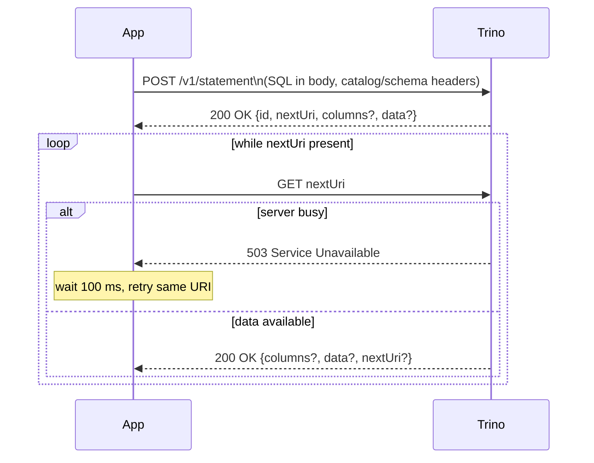

# trino-cpp-example

A minimal C++17 example of querying [Trino](https://trino.io) via its HTTP REST
API using **libcurl** for transport and **nlohmann/json** for JSON parsing.

There is no official C++ driver for Trino; this project demonstrates how to
speak the Trino REST protocol directly and can serve as a starting point for
embedding Trino queries in a C++ application.

---

## Requirements

| Dependency | Version | Notes |
|---|---|---|
| C++17 compiler | GCC 9 / Clang 9 / MSVC 2019+ | |
| CMake | 3.14+ | |
| libcurl | any recent | `libcurl-dev` (Debian/Ubuntu) or `libcurl-devel` (RHEL/Fedora) |
| nlohmann/json | 3.11+ | Fetched automatically by CMake if not already installed |

---

## Build

```bash
cmake -S . -B build
cmake --build build

rm -rf build && cmake -S . -B build -DCMAKE_BUILD_TYPE=Release 2>&1 && cmake --build build --parallel 2>&1
```

The binary is written to `build/trino-example`.

---

## Usage

```
./build/trino-example <uri> <catalog> <schema> <table> <username> <password-file> [limit]

  uri            Trino coordinator base URI  (e.g. http://localhost:8080)
  catalog        Trino catalog name
  schema         Trino schema / database name
  table          Table to query
  username       Username for basic authentication
  password-file  Path to file containing the password
  limit          Optional row limit (positive integer)
```

### Examples

First, create a password file:

```bash
echo "your_password" > ~/.trino_password
chmod 600 ~/.trino_password
```

Query all rows from the TPCH `orders` table with authentication:

```bash
./build/trino-example http://localhost:8080 tpch sf1 orders myuser ~/.trino_password
```

Limit to the first 20 rows:

```bash
./build/trino-example http://localhost:8080 tpch sf1 orders myuser ~/.trino_password 20
```

Sample output:

```
Querying tpch.sf1.orders (LIMIT 20) ...

+------------+-------------+---------------+-------------+...
| orderkey   | custkey     | orderstatus   | totalprice  |...
+------------+-------------+---------------+-------------+...
| 1          | 370         | O             | 172799.49   |...
| 2          | 781         | O             | 38426.09    |...
...
+------------+-------------+---------------+-------------+...
20 row(s)
```

---

## How it works

The Trino REST API is stateless and page-based:



### Request headers

| Header | Purpose |
|---|---|
| `X-Trino-User` | User identity (required) |
| `X-Trino-Catalog` | Default catalog for the session |
| `X-Trino-Schema` | Default schema for the session |
| `Content-Type: text/plain` | Marks the POST body as a raw SQL string |
| `Accept: application/json` | Requests JSON responses |

### Response fields used

| Field | Description |
|---|---|
| `columns` | Array of `{name, type}` objects; present once the query is analysed |
| `data` | 2-D array of row values; present while the query is executing |
| `nextUri` | URL to GET for the next page; absent when the query is complete |
| `error` | Present on query failure; contains `errorName` and `message` |

---

## Project layout

```
trino-c++-example/
├── CMakeLists.txt
├── include/
│   └── trino-query.h      # Public API: trino::Client, QueryResult, Column
└── src/
    ├── trino-query.cpp    # REST client implementation
    └── main.cpp           # CLI entry point / formatted table printer
```

### Public API

```cpp
// Construct a client bound to a coordinator, catalog, and schema.
trino::Client client("http://localhost:8080", "tpch", "sf1");

// Run SELECT * FROM orders LIMIT 100
trino::QueryResult result = client.selectAll("orders", 100);

// result.columns  → vector of {name, type}
// result.rows     → vector of rows, each row a vector of strings
```

All cell values are normalised to `std::string`: `NULL` cells become the
literal string `"NULL"`, non-string scalars (integers, booleans, etc.) are
serialised with `nlohmann::json::dump()`, and complex types (arrays, maps) are
serialised as JSON text.
